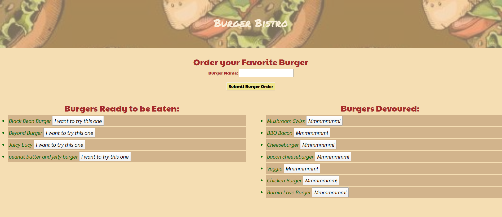

# Burger Bistro 🍔
Burger Bistro is a full-stack application that utilizes MYSQL, Node, Express, Handlebars, and ORM.
​
## Overview: 
This app uses Node and MySQL to query and route data, and Handlebars to generate the HTML.

## Getting Started:

* Please go to the following link: `https://mysterious-tundra-64510.herokuapp.com/`
* To add burgers to the "Burgers Ready to be Eaten" column, please enter and submit your burger order.
* To eat the burger, click on "I want to try this one" and it will move to the "Burgers Devoured" column.

## App Example:
​

## Technologies Used:
-   HTML
-   CSS/Bootstrap
-   Google Fonts
-	Javascript
-   Jquery
-   MYSQL
-	Node.js
-	NPM packages:
    -	Express
    -   Dotenv
    -   Express-Handlebars
    -   MYSQL
-   Heroku
-   GitHub

#### Go to npmjs if you want to know more about:

1. **Express**:  https://www.npmjs.com/package/express
2. **DotEnv**: https://www.npmjs.com/package/dotenv
3. **Express-Handlebars**: https://www.npmjs.com/package/express-handlebars
4. **MYSQL**: https://www.npmjs.com/package/mysql

## Future Enhancements:
I would add the delete function to the app for additional user flexibility.

## Connect with Me & View my Work:
- <a href="https://arohl2015.github.io/Updated-Portfolio/" target="_blank"> Portfolio </a>
- <a href="https://github.com/arohl2015" target="_blank"> GitHub </a>
- <a href="www.linkedin.com/in/aprilrohlcfp" target="_blank"> LinkedIn </a>